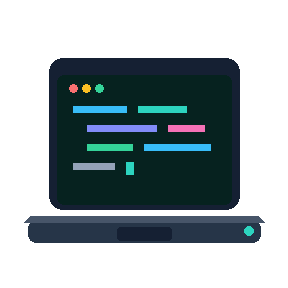

<h2 align="center">Hi, I'm Hoa Hoang — Nova! 👋</h2>

<p align="center">
  <a href="https://novahoangdev.web.app">
    <!--  -->
    
    <!--  -->
  </a>
</p>

<p align="center">
  <strong>Senior Frontend Developer</strong><br/>
  Angular · React · TypeScript · NestJS · Enterprise UI
</p>

<p align="center">
  <a href="https://novahoangdev.web.app">🌐 Portfolio & CV</a>  ·  
  <a href="https://www.linkedin.com/in/novahoangdev">💼 LinkedIn</a>  ·  
  <a href="https://x.com/novahoangdev">𝕏 X</a> ·
  <a href="mailto:novahoangdev@gmail.com">✉️ Email</a>
</p>

---

### 🦉 A little more about me...

<p>
  
  
  
  
  
  
  
</p>

```ts
const NOVA = {
  name: "Hoa Hoang",
  role: "Senior Frontend Developer",
  code: ["TypeScript", "JavaScript", "HTML", "CSS"],
  frontend: ["Angular", "React"],
  backend: ["NestJS"]
};
```

### 🚀 Currently building

- 🌐 **[Portfolio & CV](https://novahoangdev.web.app)** — my personal portfolio and interactive CV.
- 🧰 **[Dev Workspace](https://github.com/novahoangdev/dev-workspace)** — my development workspace for projects, shared context, and AI-assisted coding workflows.
- 🖥️ **[Interactive Workspace](https://github.com/novahoangdev/interactive-workspace)** — an interactive workspace experience and another way to explore my work.
- 🍎 **[Mac Dev Setup](https://github.com/novahoangdev/mac-dev-setup)** — a practical macOS setup guide for developers and AI-assisted workflows.

---

<p align="center">
  👨‍💻 I enjoy building things, experimenting with new ideas, and connecting with other developers.
</p>

<p align="center">
  <a href="mailto:novahoangdev@gmail.com">✉️ Email me</a> ·
  <a href="https://novahoangdev.web.app"><strong>✨ Explore my portfolio</strong></a>
</p>
